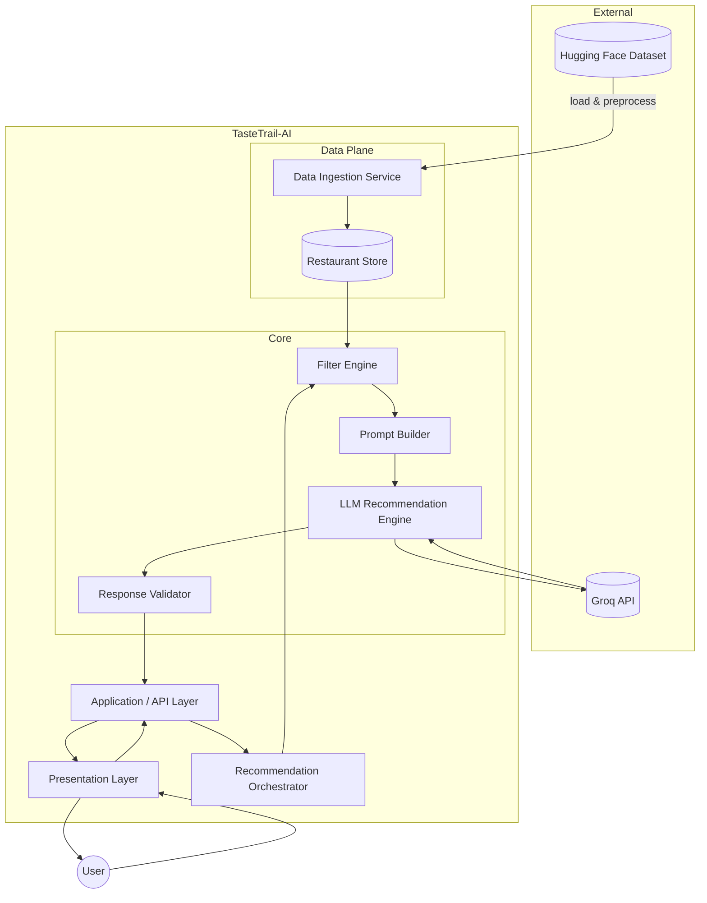
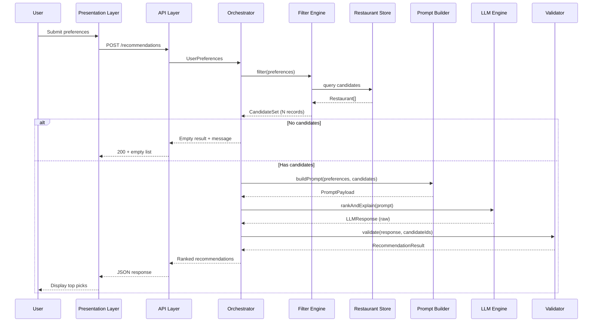
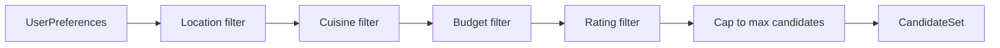
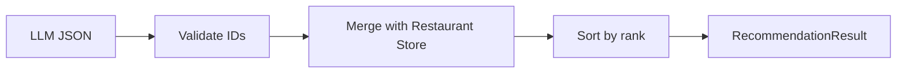
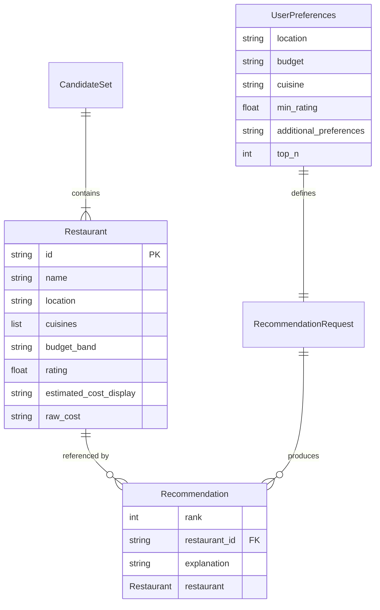
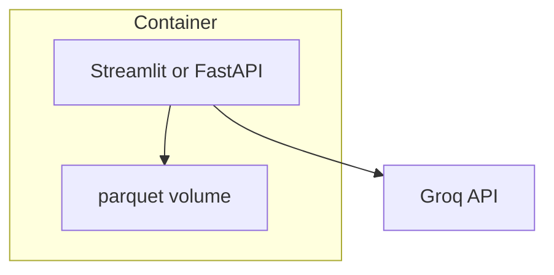

# TasteTrail-AI — System Architecture

This document defines the technical architecture for **TasteTrail-AI**, derived from [problemStatement.md](./problemStatement.md). It describes components, data flows, interfaces, and implementation guidance for the AI-powered restaurant recommendation system.

---

## 1. Architectural Goals

| Goal | How the architecture supports it |
|------|-----------------------------------|
| **Grounded recommendations** | LLM only sees pre-filtered dataset records; output is validated against candidate IDs |
| **Constraint fidelity** | Hard filters (location, budget, rating, cuisine) run before LLM invocation |
| **Explainability** | LLM produces per-restaurant rationale tied to user preferences |
| **Maintainability** | Clear separation: ingestion, filtering, prompting, ranking, presentation |
| **Extensibility** | Groq-backed LLM with swappable adapter layer; UI and storage decoupled from core logic |

---

## 2. High-Level Architecture

TasteTrail-AI follows a **layered pipeline architecture**: structured data narrows the search space; the LLM adds ranking and natural-language explanation on a bounded candidate set.



### Layer Summary

| Layer | Responsibility |
|-------|----------------|
| **Presentation** | Collect preferences; render ranked results with explanations |
| **Application / API** | HTTP or in-process boundary; request validation; error mapping |
| **Orchestration** | End-to-end recommend flow: filter → prompt → LLM → validate → respond |
| **Data plane** | Dataset load, normalization, persistence or in-memory cache |
| **Core services** | Filtering, prompt construction, LLM calls, output grounding |

---

## 3. End-to-End Request Flow



**Pipeline stages** (maps 1:1 to problem statement workflow):

1. **Data ingestion** — One-time or scheduled load from Hugging Face into normalized store  
2. **User input** — Validated preference object  
3. **Integration layer** — Filter + prompt assembly  
4. **Recommendation engine** — LLM rank, explain, summarize  
5. **Output display** — Structured response rendered in UI  

---

## 4. Component Design

### 4.1 Data Ingestion Service

**Purpose:** Load the Zomato dataset, clean it, and produce a queryable restaurant catalog.

| Concern | Design decision |
|---------|-----------------|
| **Source** | `datasets` library → `ManikaSaini/zomato-restaurant-recommendation` (~51k rows) |
| **Trigger** | CLI script or startup job; optional refresh on schedule |
| **Processing** | Normalize city/location strings; parse cuisines (comma-separated → list); map cost to budget band; coerce ratings to float |
| **Output** | Writes to **Restaurant Store** (see §5) |

**Ingestion pipeline steps:**

```
Raw HF rows → schema mapping → dedupe (if needed) → normalize fields → validate → persist
```

**Normalization rules (examples):**

- **Location:** Trim, title-case city; strip inconsistent suffixes  
- **Cuisine:** Split on `,` / `;`; lowercase tokens for matching; keep display string  
- **Cost:** Map numeric or bucket labels → `low` \| `medium` \| `high`  
- **Rating:** Parse to `float`; drop or flag invalid rows  

---

### 4.2 Restaurant Store

**Purpose:** Single source of truth for filtering and prompt context.

| Option | When to use |
|--------|-------------|
| **In-memory (pandas / Polars)** | MVP, local dev, single-process app |
| **SQLite / DuckDB** | Persistent cache, faster repeated filters |
| **Parquet file** | Simple deploy artifact after ingestion |

**Recommended MVP:** Ingest once → save `data/processed/restaurants.parquet` → load at app startup into memory.

**Index strategy for filters:**

- Location (exact or case-insensitive match on city)  
- Cuisine (contains / any-of)  
- Budget band (enum)  
- Rating (≥ minimum)  

---

### 4.3 Filter Engine

**Purpose:** Apply **hard constraints** before any LLM call. Reduces tokens, cost, and hallucination risk.



| Filter | Type | Behavior |
|--------|------|----------|
| Location | Hard | Match user city (case-insensitive) |
| Minimum rating | Hard | `rating >= min_rating` |
| Cuisine | Hard (if specified) | Restaurant cuisines intersect user choice |
| Budget | Hard | Match `low` / `medium` / `high` band |
| Additional prefs | Soft (optional) | Keyword match on description/tags if available; else pass to LLM only |

**Candidate cap:** Limit to top **K** records (e.g. 15–25) after deterministic pre-sort (e.g. by rating desc) to stay within LLM context limits.

**Empty result handling:** Return user-friendly message suggesting relaxed filters (e.g. lower rating or broader budget)—do not call LLM.

---

### 4.4 Prompt Builder (Integration Layer)

**Purpose:** Serialize user preferences + candidate restaurants into a structured LLM prompt.

**Prompt structure:**

1. **System message** — Role, grounding rules, output JSON schema  
2. **User message** — Preferences + tabular or JSON list of candidates (id, name, cuisine, rating, cost, location)  
3. **Constraints for LLM** — Only recommend from provided IDs; no invented restaurants  

**Grounding rules (include in system prompt):**

- Use only restaurants from the supplied list  
- Return restaurant `id` for each recommendation  
- Rank at most `top_n` (e.g. 5)  
- Explanations must reference user-stated preferences  

---

### 4.5 LLM Recommendation Engine

**Purpose:** Rank candidates and generate explanations (and optional summary).

| Aspect | Design |
|--------|--------|
| **Interface** | `RecommendationEngine` with `rank_and_explain(prompt) -> LLMResponse` |
| **Provider** | **[Groq](https://console.groq.com/)** — primary LLM for TasteTrail-AI; accessed via Groq’s OpenAI-compatible Chat Completions API (`https://api.groq.com/openai/v1`) |
| **SDK / client** | `openai` Python SDK pointed at Groq base URL, or `groq` SDK |
| **Default model** | e.g. `llama-3.3-70b-versatile` (fast inference; swap per quality/cost needs) |
| **Output format** | Structured JSON (`response_format: json_object`) for reliable parsing |
| **Temperature** | Low (0.2–0.5) for consistent ranking |
| **Retries** | Retry on rate limit / timeout with backoff |
| **Fallback** | If LLM fails: return filter-sorted top-N with template explanation |

**Expected LLM output schema:**

```json
{
  "summary": "Optional one-paragraph overview of top picks",
  "recommendations": [
    {
      "restaurant_id": "string",
      "rank": 1,
      "explanation": "Why this fits the user's preferences"
    }
  ]
}
```

---

### 4.6 Response Validator

**Purpose:** Enforce grounding and merge LLM output with canonical restaurant data.

**Validation checks:**

- Every `restaurant_id` exists in the candidate set  
- No duplicate ranks  
- Drop or flag entries with unknown IDs  
- Hydrate full display fields from store (name, cuisine, rating, cost)—**never trust LLM for numeric facts**



---

### 4.7 Presentation Layer

**Purpose:** Collect input and display recommendations.

| UI option | Fit |
|-----------|-----|
| **Streamlit** | Fastest MVP; forms + results on one app |
| **React + REST API** | Production-style separation |
| **Gradio** | Demo-focused, minimal frontend code |

**Screens / sections:**

1. Preference form (location, budget, cuisine, min rating, extras)  
2. Loading state during recommend call  
3. Results: summary (optional) + cards per restaurant  
4. Empty / error states with actionable hints  

---

### 4.8 API Layer (optional but recommended)

Expose a thin REST boundary so UI and orchestration stay decoupled.

| Endpoint | Method | Description |
|----------|--------|-------------|
| `/health` | GET | Liveness |
| `/recommendations` | POST | Body: `UserPreferences` → `RecommendationResult` |
| `/locations` | GET | Distinct cities for autocomplete (optional) |
| `/cuisines` | GET | Distinct cuisines for dropdown (optional) |

---

## 5. Domain Model

### 5.1 Core Entities



### 5.2 Type Definitions (conceptual)

**Restaurant** (normalized catalog row):

| Field | Type | Notes |
|-------|------|-------|
| `id` | string | Stable hash or dataset index |
| `name` | string | Display name |
| `location` | string | City / area |
| `cuisines` | list[string] | Normalized tags |
| `budget_band` | enum | `low`, `medium`, `high` |
| `rating` | float | Aggregate rating |
| `estimated_cost` | string | Human-readable (e.g. "₹500 for two") |

**UserPreferences:**

| Field | Type | Required |
|-------|------|----------|
| `location` | string | Yes |
| `budget` | enum | Yes |
| `cuisine` | string | No |
| `min_rating` | float | No (default e.g. 3.0) |
| `additional_preferences` | string | No |
| `top_n` | int | No (default 5) |

**RecommendationResult:**

| Field | Type |
|-------|------|
| `summary` | string (optional) |
| `recommendations` | list[Recommendation] |
| `metadata` | filters applied, candidate count, latency |

---

## 6. Recommended Project Structure

```
TasteTrail-AI/
├── docs/
│   ├── problemStatement.md
│   └── architecture.md          # this document
├── data/
│   ├── raw/                     # optional HF download cache
│   └── processed/
│       └── restaurants.parquet
├── src/
│   └── tastetrail/
│       ├── __init__.py
│       ├── config.py            # env, paths, LLM settings
│       ├── models/
│       │   ├── restaurant.py
│       │   ├── preferences.py
│       │   └── recommendation.py
│       ├── ingestion/
│       │   ├── loader.py        # HF dataset load
│       │   ├── normalizer.py
│       │   └── pipeline.py
│       ├── store/
│       │   └── restaurant_store.py
│       ├── filtering/
│       │   └── filter_engine.py
│       ├── llm/
│       │   ├── prompt_builder.py
│       │   ├── engine.py
│       │   ├── validator.py
│       │   └── providers/       # groq (primary)
│       ├── orchestration/
│       │   └── recommender.py
│       └── api/
│           ├── routes.py
│           └── schemas.py
├── scripts/
│   └── ingest_data.py
├── app/                         # Streamlit or frontend
│   └── main.py
├── tests/
│   ├── test_filter_engine.py
│   ├── test_validator.py
│   └── test_ingestion.py
├── .env.example
├── requirements.txt
└── README.md
```

---

## 7. Technology Stack (Recommended)

| Layer | Technology | Rationale |
|-------|------------|-----------|
| Language | Python 3.11+ | Ecosystem for data + LLM SDKs |
| Dataset | `datasets`, `pandas` / `polars` | Native Hugging Face integration |
| API | FastAPI | Typed routes, OpenAPI docs |
| UI (MVP) | Streamlit | Rapid forms and result display |
| LLM | **Groq API** (OpenAI-compatible) | Fast inference, JSON mode, cost-effective for MVP |
| Config | `pydantic-settings`, `.env` | Secrets outside code |
| Testing | `pytest` | Unit tests for filter and validator |

Stack is **advisory**; core boundaries (store, filter, prompt, engine, validator) stay stable if tools change.

---

## 8. Configuration & Secrets

| Variable | Purpose |
|----------|---------|
| `LLM_PROVIDER` | `groq` (default) |
| `LLM_API_KEY` | Groq API key from [Groq Console](https://console.groq.com/keys) |
| `LLM_BASE_URL` | Optional; default `https://api.groq.com/openai/v1` |
| `LLM_MODEL` | e.g. `llama-3.3-70b-versatile`, `llama-3.1-8b-instant` |
| `DATA_PATH` | Path to processed parquet |
| `MAX_CANDIDATES` | Cap before LLM (default 20) |
| `DEFAULT_TOP_N` | Recommendations returned (default 5) |

Never commit `.env`; ship `.env.example` with placeholders.

---

## 9. Non-Functional Requirements

### 9.1 Performance

| Stage | Target (MVP) |
|-------|----------------|
| Filter on 50k rows (in-memory) | < 100 ms |
| LLM call (Groq) | 1–5 s typical (model-dependent) |
| Total request | < 15 s with loading indicator |

### 9.2 Reliability

- Idempotent ingestion script  
- Graceful LLM fallback (deterministic sort + template text)  
- Timeouts on external API calls  

### 9.3 Security & Privacy

- API keys server-side only  
- No storage of user PII required for MVP  
- Rate-limit public API if deployed  

### 9.4 Observability

- Structured logs: `request_id`, filter count, LLM latency, validation drops  
- Optional: log prompt token count (not full prompt in production)  

---

## 10. Error Handling Strategy

| Scenario | HTTP / UX behavior |
|----------|-------------------|
| Invalid preferences | 400 + field errors |
| Zero candidates after filter | 200 + empty list + suggestion to relax filters |
| LLM timeout / error | 503 or 200 with fallback rankings |
| Invalid LLM JSON | Retry once; then fallback |
| Hallucinated restaurant ID | Stripped by validator; log warning |

---

## 11. Testing Strategy

| Level | Focus |
|-------|--------|
| **Unit** | Normalizer, budget mapping, each filter rule, validator ID checks |
| **Integration** | Ingestion → store → filter with fixture preferences |
| **Contract** | Mock LLM returns fixed JSON; assert merged output shape |
| **E2E (optional)** | UI smoke: submit form → see N results |

**Critical test cases:**

- Location mismatch → empty candidates  
- `min_rating` boundary (exactly equal passes)  
- LLM returns unknown ID → excluded from final list  
- All candidates filtered out → no LLM invocation  

---

## 12. Deployment Topology

### 12.1 Local / Development

```
streamlit run app/main.py
# or
uvicorn src.tastetrail.api.main:app --reload
```

### 12.2 Single-container (MVP)



- Bake or mount `restaurants.parquet`  
- Inject Groq `LLM_API_KEY` at runtime  

### 12.3 Future Production

- Separate **ingestion job** (scheduled) from **stateless API replicas**  
- Object storage for parquet; Redis optional for location/cuisine facets  
- CDN + static frontend if moving off Streamlit  

---

## 13. Evolution Roadmap

| Phase | Scope |
|-------|--------|
| **M1 — MVP** | Ingestion script, in-memory store, filter + LLM + Streamlit |
| **M2 — Hardening** | Validator, fallback, tests, FastAPI |
| **M3 — UX** | Autocomplete, filter relax hints, comparison view |
| **M4 — Scale** | DB store, caching, batch ingestion, monitoring |

---

## 14. Architecture ↔ Problem Statement Traceability

| Problem statement section | Architecture component |
|---------------------------|-------------------------|
| Data ingestion | §4.1 Data Ingestion Service, §4.2 Restaurant Store |
| User input | §4.7 Presentation, §5.2 UserPreferences, §4.8 API |
| Integration layer | §4.3 Filter Engine, §4.4 Prompt Builder |
| Recommendation engine | §4.5 LLM Engine, §4.6 Validator |
| Output display | §4.7 Presentation, hydrated §5.2 RecommendationResult |
| Grounded recommendations | §4.6 Validator, grounding rules in §4.4 |
| Success criteria | §1 Goals, §9 NFRs, §11 Testing |

---

## 15. Open Decisions

Document choices as the project starts:

1. **Exact dataset column mapping** — Inspect HF schema on first ingest  
2. **Budget band thresholds** — Define rupee ranges for low / medium / high  
3. **Groq model selection** — Default `llama-3.3-70b-versatile`; tune for speed vs. explanation quality  
4. **UI choice** — Streamlit vs. React for demo vs. product goals  

**Resolved:** LLM provider is **Groq** (not OpenAI/Anthropic direct).

---

*This architecture implements the workflow defined in [problemStatement.md](./problemStatement.md) and should be updated when stack or scope decisions are finalized.*
