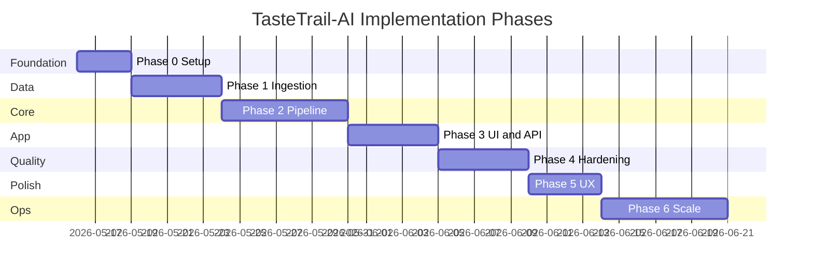

# TasteTrail-AI — Phase-Wise Implementation Plan

This plan translates [problemStatement.md](./problemStatement.md) and [architecture.md](./architecture.md) into executable phases with tasks, deliverables, acceptance criteria, and dependencies.

---

## Overview

| Phase | Name | Goal | Est. duration |
|-------|------|------|----------------|
| **0** | Foundation & setup | Repo, tooling, config, domain models | 2–3 days |
| **1** | Data plane (MVP) | Ingest HF dataset → normalized parquet → store | 3–5 days |
| **2** | Core pipeline | Filter → prompt → LLM → validate → orchestrate | 5–7 days |
| **3** | Application layer | Streamlit UI + optional FastAPI | 3–5 days |
| **4** | Hardening & quality | Tests, fallback, errors, logging | 3–5 days |
| **5** | UX enhancements | Autocomplete, empty-state hints, polish | 2–4 days |
| **6** | Scale & deploy (optional) | Container, CI, monitoring, DB store | 5+ days |

**Total (Phases 0–4, demo-ready):** ~3–4 weeks part-time or ~1.5–2 weeks full-time.

**LLM provider:** [Groq](https://groq.com/) — fast inference via OpenAI-compatible API; see [architecture.md](./architecture.md) §4.5 and §8.

---

## Phase 0 — Foundation & Project Setup

**Maps to:** Architecture §6 (project structure), §7 (stack), §8 (config)

### Objectives

- Establish repository layout, dependencies, and configuration patterns before feature work.
- Define Pydantic models shared across ingestion, filtering, and LLM layers.

### Tasks

| # | Task | Output |
|---|------|--------|
| 0.1 | Initialize Python project (`pyproject.toml` or `requirements.txt`) | Pin: `pandas`, `datasets`, `pydantic`, `pydantic-settings`, `python-dotenv` |
| 0.2 | Create folder structure per architecture §6 | `src/tastetrail/`, `data/`, `scripts/`, `tests/`, `app/` |
| 0.3 | Add `.env.example` and `config.py` | `DATA_PATH`, `LLM_*`, `MAX_CANDIDATES`, `DEFAULT_TOP_N` |
| 0.4 | Implement domain models | `Restaurant`, `UserPreferences`, `Recommendation`, `RecommendationResult`, `CandidateSet` |
| 0.5 | Add `README.md` with setup steps | Clone, venv, ingest, run app |
| 0.6 | Configure `pytest` and basic CI stub (optional) | `tests/conftest.py`, sample fixture |

### Deliverables

- Runnable empty package: `python -c "import tastetrail"`
- Documented env vars in `.env.example`
- Typed models in `src/tastetrail/models/`

### Acceptance criteria

- [ ] `pip install -r requirements.txt` succeeds on Python 3.11+
- [ ] Config loads from `.env` without hardcoded secrets
- [ ] Models serialize/deserialize via Pydantic JSON schema

### Dependencies

- None (first phase)

---

## Phase 1 — Data Plane (Ingestion & Store)

**Maps to:** Problem statement §“Data Ingestion”; Architecture §4.1, §4.2

### Objectives

- Load ~51k rows from Hugging Face, normalize fields, persist to parquet.
- Provide `RestaurantStore` for in-memory filtering at runtime.

### Tasks

| # | Task | Output |
|---|------|--------|
| 1.1 | **Inspect dataset schema** — load HF sample, document column mapping | `docs/datasetSchema.md` (or section in README) |
| 1.2 | Implement `loader.py` — `load_dataset("ManikaSaini/zomato-restaurant-recommendation")` | Raw DataFrame |
| 1.3 | Implement `normalizer.py` | Location trim/title-case; cuisine split; rating → float; cost → `budget_band` |
| 1.4 | Define **budget band rules** (open decision §15) | e.g. low &lt; ₹300, medium ₹300–700, high &gt; ₹700 (adjust after schema inspect) |
| 1.5 | Assign stable `id` per row (hash or index) | Unique `Restaurant.id` |
| 1.6 | Implement `pipeline.py` + `scripts/ingest_data.py` | Writes `data/processed/restaurants.parquet` |
| 1.7 | Implement `restaurant_store.py` | `load()`, `get_by_id()`, `all()`, `distinct_locations()`, `distinct_cuisines()` |
| 1.8 | Handle invalid rows | Log count dropped; document in ingest summary |
| 1.9 | Unit tests for normalizer | `tests/test_ingestion.py` |

### Deliverables

- `data/processed/restaurants.parquet` (generated locally, gitignored or LFS)
- CLI: `python scripts/ingest_data.py`
- `RestaurantStore` loaded at startup from `DATA_PATH`

### Acceptance criteria

- [ ] Ingestion is **idempotent** (re-run produces same row count ± documented drops)
- [ ] Parquet contains: `id`, `name`, `location`, `cuisines`, `budget_band`, `rating`, `estimated_cost`
- [ ] Store loads &lt; 5s on typical dev machine
- [ ] Sample filter: location = "Bangalore" returns non-empty set

### Dependencies

- Phase 0 complete

### Risks & mitigations

| Risk | Mitigation |
|------|------------|
| Column names differ from assumptions | Phase 1.1 schema inspect before normalizer |
| Cost field ambiguous | Fallback rules + manual mapping table in config |

---

## Phase 2 — Core Recommendation Pipeline

**Maps to:** Problem statement §“Integration Layer” & §“Recommendation Engine”; Architecture §4.3–§4.6, §3 (orchestration)

### Objectives

- Implement filter → prompt → LLM → validate → orchestrate without UI.
- Prove end-to-end recommend flow via script or pytest.

### Sub-phases

#### 2A — Filter Engine

| # | Task | Output |
|---|------|--------|
| 2A.1 | `filter_engine.py` — location (case-insensitive) | Hard filter |
| 2A.2 | Rating filter `rating >= min_rating` | Hard filter |
| 2A.3 | Cuisine filter (intersection if user specified) | Hard filter |
| 2A.4 | Budget band filter | Hard filter |
| 2A.5 | Pre-sort by rating desc + cap at `MAX_CANDIDATES` | `CandidateSet` |
| 2A.6 | Empty candidate message with relax hints | No LLM call when empty |
| 2A.7 | Unit tests | Location mismatch, rating boundary, cap behavior |

#### 2B — LLM Integration (Groq)

| # | Task | Output |
|---|------|--------|
| 2B.1 | `prompt_builder.py` — system + user messages, JSON schema in prompt | `PromptPayload` |
| 2B.2 | Grounding rules in system prompt | IDs only, no invented restaurants |
| 2B.3 | `engine.py` + `providers/groq.py` — Groq Chat Completions (OpenAI-compatible) | `rank_and_explain()` |
| 2B.4 | Structured JSON parsing with retry on malformed response | Parsed `LLMResponse` |
| 2B.5 | Config: `LLM_PROVIDER=groq`, model, temperature 0.2–0.5, timeout, retry backoff | Per architecture §4.5 |
| 2B.6 | **Fallback** — top-N by rating + template explanation | On timeout / parse failure |

#### 2C — Validator & Orchestrator

| # | Task | Output |
|---|------|--------|
| 2C.1 | `validator.py` — ID in candidate set, dedupe ranks | Stripped hallucinations |
| 2C.2 | Merge LLM output with store (hydrate name, cuisine, rating, cost) | `RecommendationResult` |
| 2C.3 | `recommender.py` orchestrator | `recommend(preferences) -> RecommendationResult` |
| 2C.4 | Metadata: `candidate_count`, `latency_ms`, `used_fallback` | In result metadata |
| 2C.5 | Integration test with **mocked LLM** | Contract test |

### Deliverables

- `Recommender.recommend(UserPreferences)` callable from Python
- Optional CLI: `python -m tastetrail.cli --location Delhi --budget medium`

### Acceptance criteria

- [ ] **Success criteria (problem statement):** IDs in output ⊆ candidate IDs
- [ ] Hard filters never bypassed before LLM
- [ ] Zero candidates → empty result, **no** API call to LLM
- [ ] Fallback produces valid `RecommendationResult` when LLM fails
- [ ] Each recommendation includes explanation + hydrated restaurant fields

### Dependencies

- Phase 1 complete (parquet + store)
- **Groq API key** in `.env` (`LLM_API_KEY`) for manual/integration tests — from [Groq Console](https://console.groq.com/keys)

---

## Phase 3 — Application Layer (UI & API)

**Maps to:** Problem statement §“User Input” & §“Output Display”; Architecture §4.7, §4.8

### Objectives

- Expose recommendation flow to users via Streamlit (primary) and optionally FastAPI.

### Tasks

| # | Task | Output |
|---|------|--------|
| 3.1 | **Streamlit** `app/main.py` — preference form | location, budget, cuisine, min_rating, additional, top_n |
| 3.2 | Wire form → `Recommender.recommend()` | Submit button triggers flow |
| 3.3 | Loading spinner during LLM (2–10s) | UX per NFR §9.1 |
| 3.4 | Results UI — summary + cards | name, cuisine, rating, cost, explanation |
| 3.5 | Empty state — show relax hints from filter engine | Actionable copy |
| 3.6 | Error state — invalid input, LLM failure (show fallback note) | Clear messaging |
| 3.7 | **(Optional)** FastAPI `routes.py` | `GET /health`, `POST /recommendations` |
| 3.8 | **(Optional)** OpenAPI schemas mirroring Pydantic models | Auto-generated docs |

### Deliverables

- `streamlit run app/main.py` — full demo path
- Optional: `uvicorn` for REST clients

### Acceptance criteria

- [ ] User can complete flow: **preferences → top N recommendations with explanations**
- [ ] All four objectives from problem statement are demonstrable in UI
- [ ] Display fields match problem statement output list (name, cuisine, rating, cost, explanation)

### Dependencies

- Phase 2 complete

---

## Phase 4 — Hardening, Testing & Reliability

**Maps to:** Architecture §9–§11, §10 (errors); Problem statement success criteria

### Objectives

- Raise confidence via automated tests, structured logging, and consistent error handling.

### Tasks

| # | Task | Output |
|---|------|--------|
| 4.1 | Expand unit tests — filter, validator, normalizer | ≥80% coverage on core modules (target) |
| 4.2 | Integration test: ingest fixture → filter → mock LLM → result | `tests/test_integration.py` |
| 4.3 | Critical cases from architecture §11 | Unknown ID, empty filter, min_rating boundary |
| 4.4 | Structured logging | `request_id`, candidate count, LLM latency, validation drops |
| 4.5 | HTTP error mapping (if API) | 400 invalid prefs, 200 empty, fallback on LLM error |
| 4.6 | Input validation on API/UI | Pydantic validators (budget enum, rating range) |
| 4.7 | Document manual test checklist | In README or `docs/testPlan.md` |

### Deliverables

- `pytest` green locally
- Manual test plan for demo scenarios (Delhi + Italian + high budget, etc.)

### Acceptance criteria

- [ ] `pytest` passes without LLM key (mocked tests)
- [ ] Validator never exposes hallucinated restaurant in production path
- [ ] Logs sufficient to debug a failed recommend request
- [ ] Problem statement success criteria verified via checklist

### Dependencies

- Phases 2–3 complete

---

## Phase 5 — UX Enhancements

**Maps to:** Architecture §13 M3; Problem statement optional preferences

### Objectives

- Improve discoverability and usability without changing core pipeline contracts.

### Tasks

| # | Task | Output |
|---|------|--------|
| 5.1 | `GET /locations` and `GET /cuisines` (or Streamlit cached loaders) | Dropdowns / autocomplete |
| 5.2 | Budget labels with rupee hints in UI | “Low (under ₹300)” etc. |
| 5.3 | “Relax filters” suggestions when empty | Pre-computed hints (lower rating, drop cuisine) |
| 5.4 | Optional comparison view — side-by-side top 3 | Enhanced results section |
| 5.5 | Pass `additional_preferences` prominently in prompt | Better family-friendly / quick service matching |
| 5.6 | Basic styling — consistent spacing, headers, icons | Polished Streamlit layout |

### Deliverables

- Improved Streamlit UX; optional API facet endpoints

### Acceptance criteria

- [ ] User can pick location/cuisine from dataset-backed lists
- [ ] Empty results include at least one concrete suggestion to relax filters

### Dependencies

- Phase 3 complete (Phase 4 recommended first)

---

## Phase 6 — Scale, Deploy & Operations (Optional)

**Maps to:** Architecture §12; §13 M4

### Objectives

- Prepare for shared deployment, repeatable builds, and operational visibility.

### Tasks

| # | Task | Output |
|---|------|--------|
| 6.1 | `Dockerfile` — app + mounted/baked parquet | Single-container MVP |
| 6.2 | `docker-compose.yml` with env file | Local prod-like run |
| 6.3 | GitHub Actions — lint, test, optional image build | CI pipeline |
| 6.4 | Scheduled ingestion job (cron / GH Action) | Refresh parquet periodically |
| 6.5 | Migrate store to SQLite/DuckDB (if needed) | Faster facets / filters |
| 6.6 | Rate limiting on public API | Security §9.3 |
| 6.7 | Basic metrics — request count, latency histogram | Prometheus or cloud equivalent |
| 6.8 | Deploy target (Railway, Render, Fly.io, Azure) | Document in README |

### Deliverables

- Container image + deploy runbook
- CI badge in README

### Acceptance criteria

- [ ] Fresh clone → `docker compose up` → working recommend flow with env vars
- [ ] Ingestion runnable independently of web app

### Dependencies

- Phases 0–4 complete; Phase 5 optional

---

## Cross-Phase Traceability Matrix

| Problem statement | Architecture section | Phase(s) |
|-------------------|----------------------|----------|
| Data ingestion | §4.1, §4.2 | **1** |
| User input | §4.7, §5.2, §4.8 | **0**, **3** |
| Integration layer | §4.3, §4.4 | **2A**, **2B** |
| Recommendation engine | §4.5, §4.6 | **2B**, **2C** |
| Output display | §4.7, §5.2 | **3**, **5** |
| Grounded recommendations | §4.6, §4.4 | **2C**, **4** |
| Success criteria (all) | §1, §9, §11 | **2**, **4** |

---

## Milestone Checklist (Demo-Ready)

Use this as the **minimum shippable** definition before Phases 5–6:

| Milestone | Phase | Demo script |
|-----------|-------|-------------|
| **M0** | 0 | Import package; load config |
| **M1** | 1 | Run ingest; print Bangalore restaurant count |
| **M2** | 2 | CLI/script prints top 5 with LLM explanations |
| **M3** | 3 | Streamlit demo for stakeholder |
| **M4** | 4 | `pytest` green; fallback demonstrated |

---

## Suggested Implementation Order (Daily Breakdown)

### Week 1

| Day | Focus |
|-----|--------|
| D1 | Phase 0 — structure, models, config |
| D2 | Phase 1.1–1.3 — schema inspect, loader, normalizer |
| D3 | Phase 1.4–1.9 — pipeline, store, ingest tests |
| D4 | Phase 2A — filter engine + tests |
| D5 | Phase 2B — prompt builder + LLM provider |

### Week 2

| Day | Focus |
|-----|--------|
| D6 | Phase 2C — validator, orchestrator, mock integration test |
| D7 | Phase 3 — Streamlit UI end-to-end |
| D8 | Phase 4 — tests, logging, error paths |
| D9 | Phase 4 — manual test plan + demo polish |
| D10 | Buffer / Phase 5 kickoff (autocomplete, empty hints) |

---

## Open Decisions Log

Resolve during Phase 1 or early Phase 2; record final choices here:

| Decision | Options | Target phase | Status |
|----------|---------|--------------|--------|
| Dataset column mapping | TBD after HF inspect | 1 | ⬜ Pending |
| Budget thresholds | Config-driven rupee bands | 1 | ⬜ Pending |
| LLM provider / model | **Groq** — e.g. `llama-3.3-70b-versatile` | 2 | ✅ Groq |
| UI framework | Streamlit (MVP) vs React later | 3 | ⬜ Streamlit default |
| Parquet in git | Gitignore + ingest docs vs LFS | 1 | ⬜ Gitignore recommended |

---

## Definition of Done (Per Phase)

A phase is **done** when:

1. All acceptance criteria checkboxes are satisfied  
2. Code merged to main branch (or feature branch with PR)  
3. Relevant docs updated (`README`, schema notes if Phase 1)  
4. No secrets committed; `.env.example` current  
5. Next phase dependencies explicitly unblocked  

---

## Related Documents

| Document | Purpose |
|----------|---------|
| [problemStatement.md](./problemStatement.md) | What we build and why |
| [architecture.md](./architecture.md) | How components fit together |
| **implementationPlan.md** (this file) | When and in what order to build |

---

*Update this plan as phases complete—mark decisions in the Open Decisions Log and adjust estimates based on actual schema complexity and LLM latency.*
